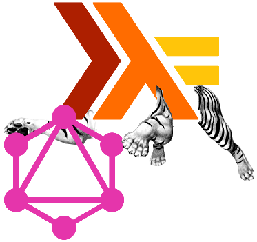

## [graphql-w-persistent](http://hackage.haskell.org/package/graphql-w-persistent)

<p align="center"></p>

#### this is a graphql query parser and interpreter, and it is including data processing to return the graphql object formats.

[](https://hackage.haskell.org/package/graphql-w-persistent)
[](https://matrix.hackage.haskell.org/package/graphql-w-persistent)
[](http://packdeps.haskellers.com/feed?needle=graphql-w-persistent)
[](https://gitter.im/graphql-w-persistent/community?utm_source=badge&utm_medium=badge&utm_campaign=pr-badge)
[](https://www.paypal.me/jasonsychau)


### News Posts

**2019-06-18 -** Version 0.4.0.0 is supporting inline fragments and comments.

##### Older news posts are found on [this page](https://github.com/jasonsychau/graphql-w-persistent/blob/master/oldnews.md).

### Stable Releases

0.3.1.1, 0.3.1.2, 0.3.2.1, 0.4.0.0

### Features

Here's a check-list from the [official documentation](https://graphql.github.io/)...

| Feature  | Present | Comments |
|----------|:-------:|----------|
| argument to root (and nested) objects | :heavy_check_mark: | 0.1.0.4 (0.3.1.2) |
| data transformation arguments on scalar fields | | :thought_balloon: |
| aliases | :heavy_check_mark: | 0.1.0.1 |
| named fragments | :heavy_check_mark: | 0.1.0.1 (within variables is not supported until 0.3.2.1) |
| operation names | | :thought_balloon: |
| variables (default value ~~and required/not~~) | :heavy_check_mark: | 0.2.0.0 (multiple variables is not supported until 0.3.2.1) |
| directives | :heavy_check_mark: | 0.3.2.1 |
| mutations  | | :thought_balloon: |
| inline fragments | :heavy_check_mark: | 0.4.0.0 |
| meta fields | | |
| non-null implementation and non-null errors (on data types and arguments) | | |
| interfaces to type heirarchy | :heavy_check_mark: | 0.1.0.4 |
| input types | | |
| introspection | | |
| pagination | | :thought_balloon: |
| authorization moderated fields and null types (authorization layer before GraphQL) | | |
| pagination for long lists (as transformations) | | |
| server-defined fields (like counts/previews from the thinking in graphs page) and user-designed schema | | |
| business logic layer | | |
| caching | | |

### Example

There is several examples. Below is an example to open a web server with this package included. You can read about applying the GraphQL database middleware to a pre-existing MySQL or Postgresql database with AWS Lambda and AWS API Gateway on my [Medium article](https://medium.com/@jasonsychau/add-graphql-interface-to-your-pre-existing-mysql-postgresql-database-ce1e52214c3c). Lastly, I'd like a star and claps if it's not too much to ask.

#### set-up

1. make sure that you have [Stack program and compilers](https://haskell-lang.org/get-started).

2. install package (there maybe is a later version)

    ```
    stack install graphql-w-persist-0.4.0.0
    ```

#### run

```
stack runghc demonstration.hs
```

At localhost:3000, the topmost text box is the GraphQL question box while below is the variables textbox. Underneath is an area to add or delete database data.

Here are example queries:

```
query Example1($withOwner: Bool) { AllPets: pet { name gender owner @include(if: $withOwner) { name gender } } AllPeople: person { name } }
```
with variable
```
{ "withOwner": false }
```

```
query Example2($asTaxonomy: Bool = false, $withGender: Bool = true) { AllPets: pet { name gender @include(if: $withGender) taxonomy @include(if: $asTaxonomy) { name } family @skip(if: $asTaxonomy) { name } genus @skip(if: $asTaxonomy) { name } species @skip(if: $asTaxonomy) { name } breed @skip(if: $asTaxonomy) { name } } }
```

```
query Example3 ($withOwner: Bool = false) { MalePets: pet (gender: 1) { ...petFields } FemalePets: pet (gender: 0) { ...petFields } } fragment petFields on Pet { name owner @include(if: $withOwner) { name } }
```

```
query Example4 { taxonomy { name ... on Species { pet { name } } } }
```
