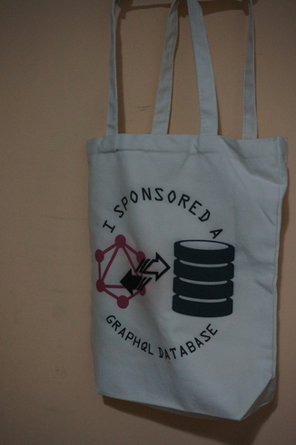

## Project Sponsors

I appreciate you.

To become a sponsor and/or purchase merchandise, you can visit the below [Merchandise section](#merchandise).

## graphql-w-persistent

#### This is an application of GraphQL to SQL database querying and processing data.

[](https://hackage.haskell.org/package/graphql-w-persistent)
[](https://matrix.hackage.haskell.org/package/graphql-w-persistent)
[](http://packdeps.haskellers.com/feed?needle=graphql-w-persistent)
<!-- [](https://gitter.im/graphql-w-persistent/community?utm_source=badge&utm_medium=badge&utm_campaign=pr-badge) -->
<!-- [](https://www.paypal.me/jasonsychau) -->


### News Posts

**2020-04-24 -** I know that there are issues with the package (like not working null values). I will address these and other improvements in a planned future update.

**2019-12-28 -** Version 0.7.0.1 is fixing the exceptions in 0.7.0.0. Version 0.8.0.0 is reducing queried data by making separate queries for every object and by reading previously queried data for parent objects. In contrast to this space-saving, data processing is slower. Thus, 0.7.0.1 is available if data is not many.

**2019-12-21 -** [Here](https://jasonsychau.github.io/graphql-w-persistent) is a companion web application to help in making your schema json file.

**2019-11-16 (Edit: 2019-11-21) -** Release 7.0.0 is fixing bugs around using commas or tabs after root objects, and I have changed the schema input to allow custom unique id columns when defining database tables. This package is now more flexible to the input schema of your database. You can use your own primary keys or unique ids for more objects to declare. Another change is declaring server objects with object fields. In this way, you can have objects with separate references against other objects - there isn't a collision (and restriction) on what field names are availble in queries.

**2019-08-31 -** Release 6.0.0 is correcting bugs of parent object arguments and of processing parental data. I also reduce the computations to the previous code. I also add arguments feature to scalar types. Will you please leave a star if I have helped? - thanks.

**2019-08-10 -** Version 5.0.0 is published where I've fixed two bugs with subsequent nested objects and with query syntax. I'm sorry that this isn't on the earlier versions. I've added metafields feature and upgraded the SQL joins to maximize data retrieval...please don't forego giving me a star on GitHub, vote on Hackage, and/or claps on my Medium post - thanks!

**2019-07-21 -** [Here's](https://medium.com/@jasonsychau/add-graphql-interface-to-your-pre-existing-mysql-postgresql-database-ce1e52214c3c) my Medium article to describe the combination of this package with AWS Lambda to have a language agnostic integration of a GraphQL database.

##### Older news posts are found on [this page](https://github.com/jasonsychau/graphql-w-persistent/blob/master/oldnews.md).

### Latest Recommended Version

[0.7.0.1](https://hackage.haskell.org/package/graphql-w-persistent-0.7.0.1), [0.8.0.0](https://hackage.haskell.org/package/graphql-w-persistent-0.8.0.0)

### Features

Here's a check-list from the [official documentation](https://graphql.github.io/)...

| Feature  | Present | Comments |
|----------|:-------:|----------|
| argument to root (and nested) objects | :heavy_check_mark: | 0.1.0.4 (0.3.1.2) |
| data transformation arguments on scalar fields | :heavy_check_mark: | 0.6.0.0 |
| aliases | :heavy_check_mark: | 0.1.0.1 |
| named fragments | :heavy_check_mark: | 0.1.0.1 (within variables is not supported until 0.3.2.1) |
| operation names | | |
| variables (default value ~~and required/not~~) | :heavy_check_mark: | 0.2.0.0 (multiple variables is not supported until 0.3.2.1) |
| directives | :heavy_check_mark: | 0.3.2.1 |
| mutations  | | :thought_balloon: |
| inline fragments | :heavy_check_mark: | 0.4.0.0 |
| meta fields | :heavy_check_mark: | 0.5.0.0 |
| non-null and non-null errors (on data types and arguments) | | |
| interfaces to type heirarchy | :heavy_check_mark: | 0.1.0.4 |
| input types | | :thought_balloon: |
| introspection | | :thought_balloon: |
| pagination | | |
| authorization moderated fields and null types (authorization layer before GraphQL) | | |
| pagination for long lists (as transformations) | | |
| server-defined fields (like counts/previews from the thinking in graphs page) and user-designed schema | | |
| business logic layer | | |
| caching | | |

### Web application

A web application is hosted to help make a schema. To see one of the features of this GraphQL interface, an example schema `example-schema.json` is saved in the `examples` folder. Once imported into application, a diagram is drawn to visualize the connections between objects. App link is [here](https://jasonsychau.github.io/graphql-w-persistent) - check it out for fully-connected schemas!

### Examples

There is five examples. One is an to open a web server. This is in the `examples/server-example` folder. You can run it by downloading project folder and following the instructions in the `README.md` file. Two examples are applying the GraphQL middleware to a pre-existing MySQL or Postgresql database. The other two are putting these onto AWS for cloud solutions. Instructions are in the `README.md` file to make AWS Lambda functions, but you can read more on my [Medium article](https://medium.com/@jasonsychau/add-graphql-interface-to-your-pre-existing-mysql-postgresql-database-ce1e52214c3c). Lastly, I'd like a star and claps.

#### set-up

1. make sure that you have [Stack program and compilers](https://haskell-lang.org/get-started).

2. download one project folder from the `examples` folder

3. follow instructions from those `README.md` files to run example project

#### examples

Here are example queries to run with the schema in `server-example`:

##### example 1
```
query Example1($withOwner: Bool) {
  AllPets: pet {
    name
    gender(as: MALEFEMALE)
    owner @include(if: $withOwner) {
      name
      gender(as: MALEFEMALE)
    }
  }
  AllPeople: person {
    name
  }
}
```
with variable
```
{ "withOwner": false }
```

##### example 2
```
query Example2($asTaxonomy: Bool = false, $withGender: Bool = true) {
  AllPets: pet {
    name
    gender(as: MALEFEMALE) @include(if: $withGender)
    taxonomy @include(if: $asTaxonomy) {
      name
    }
    family @skip(if: $asTaxonomy) {
      name
    }
    genus @skip(if: $asTaxonomy) {
      name
    }
    species @skip(if: $asTaxonomy) {
      name
    }
    breed @skip(if: $asTaxonomy) {
      name
    }
  }
}
```

##### example 3
```
query Example3 ($withOwner: Bool = false) {
  MalePets: pet (gender: 1) {
    ...petFields
  }
  FemalePets: pet (gender: 0) {
    ...petFields
  }
}

fragment petFields on Pet {
  name
  owner
  @include(if: $withOwner) {
    name
  }
}
```

##### example 4
```
query Example4 {
  taxonomy {
    name
    ... on Species {
      pet {
        name
      }
    }
  }
}
```

### Merchandise

From my [GitHub sponsors page](https://github.com/sponsors/jasonsychau), you can order printed merchandise. This is the only way to reward the developer (me) for my hard-work!

The canvas bag is simple and pretty. It is appropriate for your clothing, accessories, and snacks.


    


<!--- <p align="center"></p> --->
